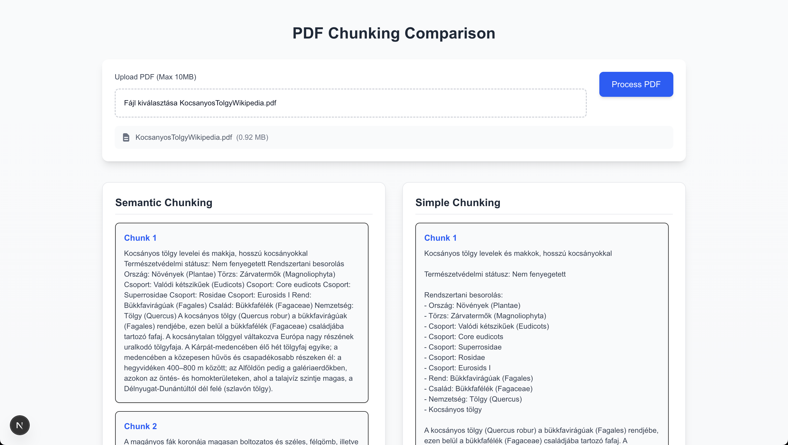

# Chunk TS

<p align="center"></p>

Demonstrate document chunking.

## Installation

First, create a `.env` file based on `.env.example`. Then run:

```
pnpm i
pnpm dev
```

## Usage

Upload a .pdf file and see how the two chunking methods chunk it.
